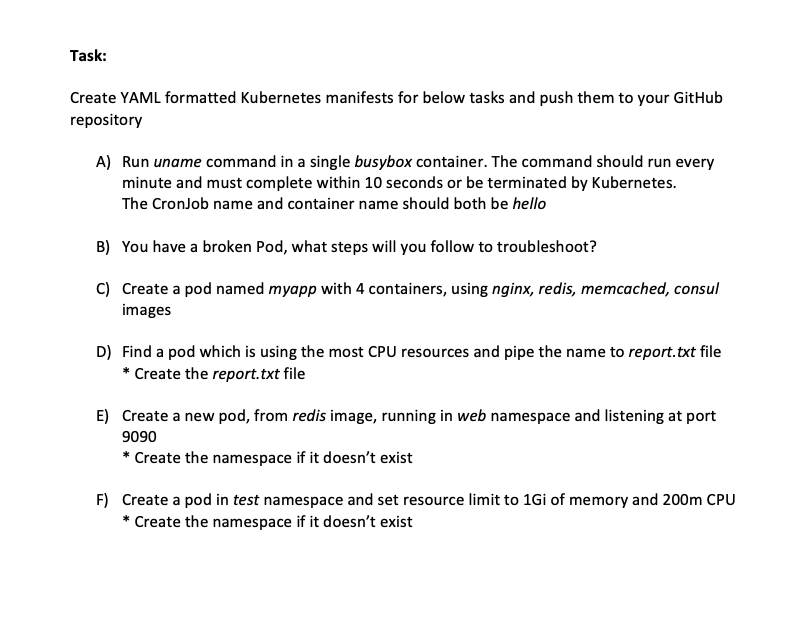

# Kubernetes-Task
---

---

# Solution

**A)** busybox.yml
* kubectl create -f busybox.yml 

**B)** myapp.yml

**C)** https://kubernetes.io/docs/tasks/debug-application-cluster/debug-application/#debugging-pods

**D)** report.txt

**command:**

* kubectl top pods > report.txt

**E)** redis-image.yml

**F)** test-pod.yml
